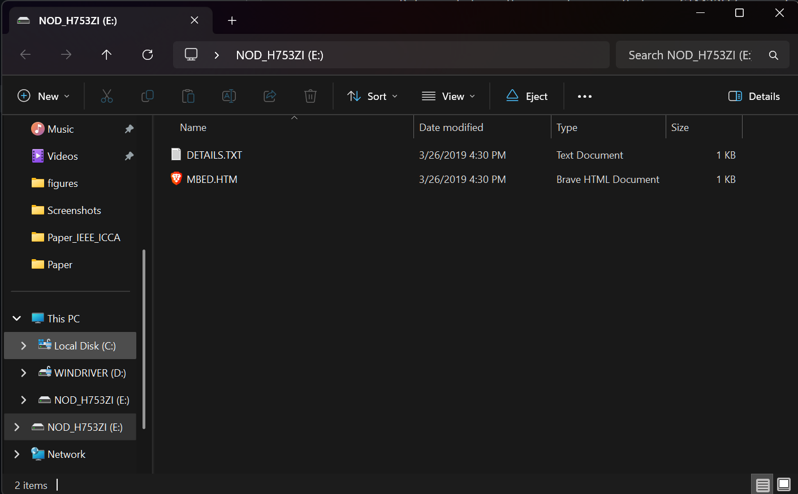
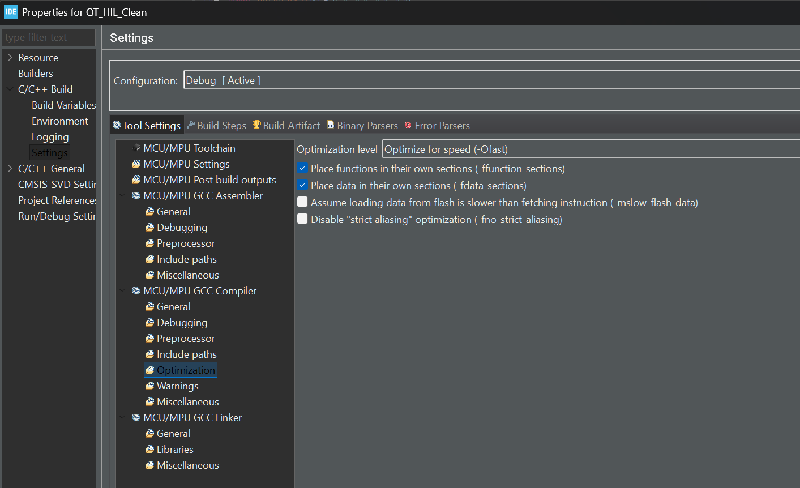

# Symbolic KAN vs. MPC on Embedded Hardware (STM32H7)

**Author:** Adilkhan Salkimbayev

**Status:** Submitted to IEEE ICCA 2026

## Overview
This repository contains the source code and experimental data for benchmarking **Symbolic Kolmogorov-Arnold Networks (KAN)** against **LTV-MPC (Linear Time-Varying MPC)** on a Non-Minimum Phase Quad-Tank system.

**Key Result:** KAN achieves a **~19500x speedup** average case (0.99µs vs 19.3ms) and **~80294x speedup** (1.02µs vs 81.9ms) worst-case while maintaining control stability under disturbance.

## Hardware Setup
 
- **MCU:** STM32H753ZI (Cortex-M7 @ 480MHz)
- **Laptop:** Acer Nitro 16 AN16-41 (AMD Ryzen 7 7840HS, RTX 4060, 16GB DDR5 RAM)
- **Method:** Hardware-in-the-Loop (HIL) via UART (921600 Baud)
- **Solver:** OSQP (for MPC) vs. Symbolic Inference (for KAN)

## Results
| Controller | Avg Latency | Worst-Case | CPU Load |
|:----------:|:-----------:|:----------:|:--------:|
| MPC (OSQP) | 19.981 ms       | 81.82 ms      | ~100%    |
| Symbolic KAN| 1.04 µs     | 1.094 µs     | 0.033%    |

## Folder Structure
- `Firmware/` (QT_HIL_Clean): C code for STM32 (System Workbench / CubeIDE).
- `Simulation/` (Diploma_Johansson_KAN_MPC_EKF): Python Plant model (ODE), Training scripts (PyKAN), and Data Logs.
- `Paper/`: PDF of my IEEE ICCA submission. (Draft, v1.0.8.3)

## Short guide on quick project launch
All files are provided **as-is** and guaranteed to work, given correct settings are applied to the hardware.

Before initializing the project, ensure that your STM32H7 connected properly and displayed as **NOD-H753ZI** as provided in the following screenshot.  

Ensure all Python libraries that are used in Jupyter Notebooks are installed on your PC. Use **`"pip install -r requirements.txt"`** to install key dependent libraries.

Additionally, use **Device Manager** to ensure that it is indeed communicating with port **COM5**. If port is different, edit **SERIAL_PORT** in the first cell of the notebook to match your **Device Manager**.

Given the aforementioned steps were verified, below is the guide to compile the given project.

## How to launch the project
1. Open **`Diploma_Johansson_EKF_MPC_KAN/01_ProjectInitiatization_HILSim.ipynb`** and initialize cells 1 (Constant variables) and 2 (Nonlinear model calculation).
2. Scroll down and find any cell that has **"import serial"**, variables **"packer"** and **"unpacker"** defined, has **"dt_hil"** constant defined in it and a **"for k in range(steps)"** loop defined in **try-catch** block.
3. Ensure your Nucleo motherboard is connected to your PC.
4. Open file **`QT_HIL_Clean/Core/config.h`** and verify the setup (Minimum Phase or Non-Minimum Phase). 
5. Open file **`QT_HIL_Clean/Core/main.c`** and debug it. Ensure the compiler is set to **"-Ofast"`** as given in the screenshot. 
6. Comment out either **KAN Controller** or **MPC Controller** depending on what controller you want to test.
7. Return to Jupyter Notebook and launch the cell you have chosen.
8. Return to STM32CubeIDE (with **Alt+Tab** shortcut on Windows) and press F8 to resume the debugging process.
9. Return back to the Jupyter Notebook and wait for the simulation to finish. Matplotlib instance would generate the plot upon completion.

Contact the repository author (**@lArtemis13l**) on socials or open a GitHub issue for questions and issues regarding the code implementation.

